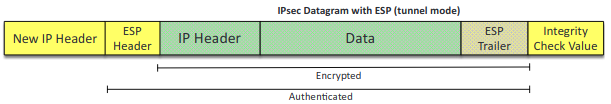
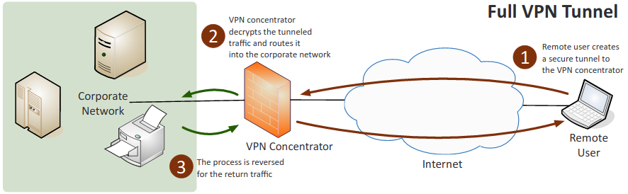
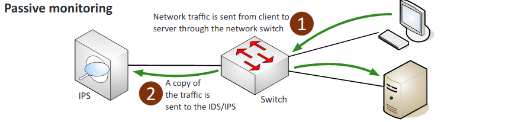
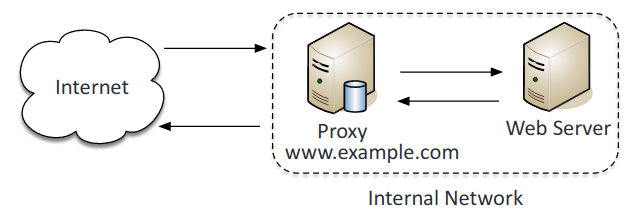
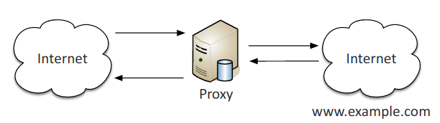
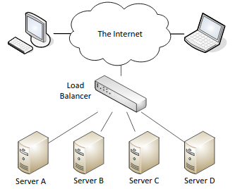

# **2.0 Technologies and Tools**

##  2.1 Install and configure network components, both hardware and software-based, to support organizational security.

1. **Firewall**: A network security system that monitors and controls incoming and outgoing network traffic based on predetermined security rules.
    1. **ACL** (Access control lists): A list of rules that can be used to control traffic based on networks, subnets, IP addresses, ports, and some protocols.
    2. Application-based vs. network-based:
        1. **Application-based**: It is typically software running on a system. Protects the user from applications and services by monitoring and potentially blocking the input, output, or system service calls that do not meet the configured policy of the firewall.
        2. **Network-based**: Filters traffic by port number based on rules and allows only authorized traffic to pass in and out of the network
    3. Stateful vs. stateless:
        1. **Stateful**: Stateful firewalls block traffic based on the state of the packet within a session. It adds and maintains information about a user's connections in a state table, referred to as a connection table.
        2. **Stateless**: Stateless firewalls uses rules within an ACL to identify allowed and/or block traffic through packet filtering. Does not keep track of flows.
    4. **Implicit deny**: The last rule in an ACL that indicates that, "all traffic that isn't explicitly allowed is implicitly denied".
2. **VPN concentrator**: A type of router device that allows for the secure creation of VPN connections and for the safe delivery of messages between VPN nodes. Allows for the handling of a large quantity of VPN tunnels.
    1. Remote access vs. site-to-site:
        1. **Remote access**: A user-to-LAN connection used by remote users.
        2. **Site-to-site**: Allows multiple sites to connect to remote sites over the internet.  
            
    2. **IPSec**: A protocol suite for securing Internet Protocol (IP) communications. Encrypts and authenticates all of the packets in a session between hosts or networks. Secures more applications than SSL and TLS.
        1. **Tunnel** mode: The default mode for IPSec, the entire pack is protected.
        2. **Transport** mode: Used for end-to-end communications in IPSec. Ex. encrypted Telnet or Remote Desktop session from a workstation to a server.  
            
        3. **Authentication Header** (AH): IPsec protocol that authenticates that the packets received were sent from the source identified in the header. MD5, SHA-1 or SHA-2.  
            
        4. **ESP** (Encapsulating Security Payload): IPSec component that provides the same services as AH and also ensures confidentiality when sending data. MD5, SHA-1 or SHA-2 for hash, 3DES or AES for encryption.  
            
    3. Split tunnel vs. full tunnel:
        1. **Split tunnel**: Only some traffic over the secure VPN while the rest of the traffic directly accesses the internet.  
            
        2. **Full tunnel**: All of the traffic is sent over the secure VPN.  
            
    4. **TLS**: The replacement of SSL to encrypt data-in-transit. Uses certificates issued by CAs.
    5. **Always-on VPN**: The user does not connect and disconnect and instead is always connected.
3. **NIPS** (Network Intrusion Prevention System)/**NIDS** (Network Intrusion Detection System):  
Watch network traffic.
    1. **Signature-based**: Detects attacks based on known attack patterns documented as attack signatures.
    2. **Heuristic/behavioral**: It detects attacks by comparing traffic against a baseline to find any anomalies.
    3. **Anomaly**: Abnormal packets or traffic.
    4. Inline vs. passive:
        1. **Inline**: Connected directly to the network and monitors the flow of data as it occurs.  
            
        2. **Passive**: Connected through a switch or port on the network and receives a copy of the flow of data as it occurs.  
            
    5. In-band vs. out-of-band:
        1. **In-band**: Sits in the network, can quickly warn of or prevent malicious traffic.
        2. **Out-of-band**: Can only warn of malicious traffic. When identifies it, sends reset frames.
    6. **Rules**: Standards set to differentiate good traffic from suspicious traffic.
    7. **Analytics**: Shows the amount, type and history of traffic coming through.
        1. **False positive**: NIPS blocks legitimate incoming traffic.
        2. **False negative**: NIPS allows harmful incoming traffic.
4. **Router**: A device that directs data traffic along specific routes.
    1. **ACLs** (Access Control List): A list of permit or deny rules detailing what can or can't enter or leave the interface.
    2. **Anti-Spoofing**: Prevent a bad guy from using someone else's address. Filter reserved IP addresses.
5. **Switch**: A networking device that connects devices together on a computer network
    1. **Port security**: Requires a username and a password and authenticate before gaining access to any of the switch interfaces.
    2. Layer 2 vs. Layer 3:
        1. **Layer 2**: Packets are sent to a specific switch port based on destination MAC addresses.
        2. **Layer 3**: Packets are sent to a specific next-hop IP address, based on destination IP address.
    3. **Loop prevention**: Spanning-tree algorithms can determine the best path to a host while blocking all other paths to prevent loops. Loops can cause a denial of service.
    4. **Flood guard**: Configuration that sets the maximum number of MAC addresses that could possibly be seen on any particular interface.
6. **Proxy**: Acts as an intermediary for requests from clients seeking resources from servers that provide those resources.
    1. Forward and reverse proxy:
        1. **Forward proxy**: Forwards requests from internal clients to external servers.  
            
        2. **Reverse proxy**: Takes in requests from the Internet and forwards them to an internal web server.  
            
        3. **Transparent**: Accepts and forwards requests without performing any modifications on them.  
            
    2. **Application/multipurpose**: A type of proxy server that knows the application protocols that it supports.
7. **Load balancer**: A reverse proxy that distributes network or application traffic across a number of servers designed to increase capacity of concurrent users and reliability of applications.  
    
    1. **Scheduling**: Sends requests to servers using set rules.
        2. **Affinity**: Sends client requests to the same server based on the client's IP address.
        3. **Round-robin**: Sends requests in a predefined order.
    2. **Active-passive**: Some servers are not active and only go active to take excess traffic or if an active server fails.
    3. **Active-active**: All servers are actively processing requests
    4. **Virtual IPs**: An IP address and a specific port number that can be used to reference different physical servers. Provides IP addresses that can float between two or more physical network nodes and provide redundancy.
8. **Access point**:
    1. **SSID**: Name of a wireless network.
    2. **MAC filtering**: A method of controlling access on a wired or wireless network by denying unapproved MAC address access to a device.
    3. **Signal strength**: The quality and distance of a signal.
    4. **Band selection/width**: Can be set between 2.4 GHz and 5 GHz depending on which 802.11 protocol is being used.
    5. Antenna types:
        1. **Omnidirectional**: Signal is evenly distributed on all sides but has no ability to focus the signal.
        2. **Directional**: Focus the signal increasing distance. (Yagi and parabolic)
        3. **Fat**: Has everything necessary to handle wireless clients. If end-user deploys several Fat Wireless Access Points, each one needs to be configured individually.
        4. **Thin**: Acts as a radio and antenna that is controlled by a wireless switch. If multiple thin wireless access points are deployed, the entire configuration takes place at the switch. This is the far cheaper option.
    6. Antenna placement:
        1. **Controller-based**: Require a controller for centralized management and are not manually configured.
        2. **Standalone**: Do not require a controller and are generally used in smaller environments.
    7. **LWAPP** (Lightweight Access Point Protocol): Manages multiple access points simultaneously.
9. **SIEM** (Security Information and Event Management):
    1. **Aggregation**: The gathering of log and event data from the different network security devices used on the network.
    2. **Correlation**: Relating various events to identifiable patterns. If those patterns threaten security, then action must be taken.
    3. **Automated alerting and triggers**: Sends messages based on configured rules based on events that occur within the log files.
    4. **Time synchronization**: Ensures that the time is the same across devices so that all security events are recorded at the same time using Network Time Protocol.
    5. **Event de-duplication**: Trimming event logging so that the same event is not recorded over and over again, overflowing log space.
    6. **Logs/WORM**: Prevents alteration of logs and archives the source logs with write protection.
10. **DLP** (Data Loss Prevention): Policies and technologies that protect data loss through theft or destruction.
    1. **USB blocking**: Prevents the use of USBs
    2. **Cloud-based**: Prevents sensitive data from being stored on the cloud without proper encryptions and authorization.
    3. **Email**: Protects against email fraud and from valuable data from being sent through email.
11. **NAC** (Network Access Control): Enforces security policies on devices that access networks to increase network visibility and reduce risk.
     1. Dissolvable vs. permanent:
         1. **Dissolvable**: Disappears after reporting information to the NAC device.
         2. **Permanent**: Resides on end devices until uninstalled.
     2. **Host health checks**: Reports sent by network access control to gather information on installeddevices.
     3. Agent vs. agentless:
         1. **Agent**: Is installed on the end device.
         2. **Agentless**: Is not installed on the device itself but instead is embedded within a Microsoft Windows Active Directory domain controller.
12. **Mail gateway**: Examines and processes all incoming and outgoing email.  
    
     1. **Spam filter**: An on-premises software solution for filtering, well spam emails.
     2. **DLP** (Data Loss Prevention): Prevents certain information leaving the organization via email.
     3. **Encryption**: Encrypt and decrypts emails being sent and received across networks.
13. **Bridge**: Provides interconnection with other bridge networks using the same protocol.
14. **SSL/TLS accelerators**: The process of offloading processor-intensive public-key encryption for TLS or its SSL to a hardware accelerator.
15. **SSL decryptors**: Allows for the user to view inside of passing Secure HTTP traffic.
16. **Media gateway**: Converts media streams between disparate telecommunications technologies.
17. **Hardware security module (HSM)**: Safeguards and manages digital keys for strong authentication and provides cryptoprocessing.

## 2.2 Given a scenario, use appropriate software tools to assess the security posture of an organization.

1. **Protocol analyzer**: Hardware or software that captures packets to decode and analyze their contents. Allows for you to easily view traffic patterns, identify unknown traffic, and verify packet filtering and security controls.
2. **Big data analytics**: Allows for the user to store large amounts of data and then easily go through it.
3. **Network scanners**: A computer program used for scanning networks to obtain user names, host names, groups, shares, and services.
    1. **Rogue system detection**: Find devices that are not supposed to be on the network, such as rogue APs.
    2. **Network mapping**: Identifying all devices on a network along with a list of ports on those devices.
4. Wireless scanners/cracker:
    1. **Wireless scanners**: Is for wireless monitoring, it scans wireless frequency bands in order to help discover rogue APs and crack passwords used by wireless APs.
    2. **Wireless cracker**: Uses wireless attacks to test if an attacker could find the passwords to gain access to parts of your network.
       1. **WEP**: Cryptographic vulnerabilities, is relatively straightforward.
       2. **WPA1 PSK and WPA2 PSK**: Uses dictionary brute force and rainbow tables attacks.
5. **Password cracker**: A program that uses the file of hashed passwords, such as a rainbow table, and then attempts to break the hashed passwords of the network. Getting the hashes is the hardest part.
6. **Vulnerability scanner**: Attempts to identify vulnerabilities, misconfigured systems, and the lack of security controls such as up-to-date patches. They can be passive or active, either way they have little impact on a system during the test.
7. **Configuration compliance scanner**: A vulnerability scanner that verifies systems are configured correctly and meet the minimum-security configurations, it typically does this by comparing the system to a file that has the proper configurations. This is an ongoing task and can be integrated with the logon process.
8. **Exploitation frameworks**: An already created set of exploits that already have all the major components designed, the user just needs to figure out how to inject them into the network. These tool sets can be used offensively by hackers or defensively by pen testers.
9. **Data sanitization tools**: Tools that overwrite data on hard drives so that it is unrecoverable, this only needs to be done once but some may do it multiple times to feel safe.
10. **Steganography tools**: Allows for the user to embed data into an image, video, sound files, or packets. It is security through obscurity.
11. **Honeypot**: Decoy systems or networks to gather information on the attacker.
12. **Backup utilities**: Important to protect data from being lost, downtime, or corrupted.
13. **Banner grabbing**: The process of capturing the initial message (the banner) from a network service. Often the banner discloses the application's identity, version information, and other sensitive information.
14. Passive vs. active:
    1. **Passive**: You are observing.
    2. **Active**: You are interacting with the network by sending traffic and trying to access parts of the network.
15. Command line tools:
    1. **ping**: The name is based on the sound made by sonar. Tests reachability, it is a primary troubleshooting tool.
    2. **netstat** (Network statistics):
        1. netstat -a: Show all active connections.
        2. netstat -b: Show binaries, for Windows.
        3. netstat -n: Does not resolve names.
    3. **tracert** (Windows)/**traceroute** (MacOS/Linux): Uses the ICMP (Internet Control Message Protocol) time to live (TTL) error message to map the path of a packet. Time in TTL is measured in hops, TTL = 1 for the first router, and 2 refers to the second router.
    4. **nslookup**/**dig** (Domain Information Groper):
        1. **nslookup**: Used to gather information from DNS servers, lookups names and IP addresses. Was replaced by dig.
        2. **dig** (Domain Information Groper): More advanced than nslookup and shows more detailed domain information. Is for Linux but can be downloaded for windows.
    5. **arp** (Address Resolution Protocol): Used to view MAC addresses.
        1. Arp -a: Views the local arp table.
    6. **ipconfig/ip/ifconfig**:
        1. ipconfig: Shows the Windows TCP/IP configuration.
        2. ip: Used to replace ifconfig on Linux. Shows and manipulates settings on the network interface card (NIC).
        3. ifconfig: Shows the Linux interface configuration.
    7. **tcpdump**: A command-line packet analyzer that allows to capture packets from the command line.
    8. **nmap**: It is designed to scan a network and create a map, this is useful as a vulnerability scanner because it can find open ports and unsecured access points.
    9. **netcat**: Is used to safely connect to remote systems using command line instead of a front-end application. Can also be used for banner grabbing.

## 2.3 Given a scenario, troubleshoot common security issues.

1. **Unencrypted credentials/clear text**: All authentication must be encrypted. Unencrypted credentials can allow for the attacker to: elevate privileges, establish a foothold, maintain persistence, and move to other networks.
2. **Logs and events anomalies**: Block all outside access until the issue is fixed, backup and preserve the current logs, and if possible, restrict access to more sensitive data till the issue is fixed.
3. **Permission issues**: Determine how much access a specific user needs to be able to complete their job. Confirm permissions on initial configurations, perform periodic audits, and provide a process for changes and updates.
4. **Access violations**: Segmentation fault, OS locks you out, or prevents access to restricted memory. A user is able to properly logon and then access systems they don’t have proper authorization for.
5. **Certificate issues**: Certificates should be signed by someone trusted, be up to date, and be properly checked.
6. **Data exfiltration**: Data is your most important asset to and attackers.
7. Misconfigured devices:
    1. **Firewall**: Provide too much access, and to audit when using a large rule base.
    2. **Content filter**: URLs are not specific, and some protocols are not filtered.
    3. **Access points**: No encryption mechanisms and Open configurations from the wireless side.
8. **Weak security configurations**: Make sure to regularly upgrade equipment and update firmware. Using hash algorithms that are susceptible to collisions.
9. **Personnel issues**: The weakest link
    1. **Policy violation**: Transferring private data or visiting unsafe websites.
    2. **Insider threat**: Authenticated users have free reign. Assign correct user rights and permissions.
    3. **Social engineering**: Deceit can cause employees to give up personal or valuable data.
    4. **Social media**: Sharing private data or personal information.
    5. **Personal email**: Uses company resources and leaves the network vulnerable.
10. **Unauthorized software**: Don’t know what it is: could conflict with company software, could be malware, or could be useful for work.
11. **Baseline deviation**: Everything is well documented, any changes to the norm should be noted, and no remote access until it matches the baseline.
12. **License compliance violation** (availability/integrity): Make sure licenses are up to date and valid.
13. **Asset management**: Identify and track assets to respond faster to security risks. Keep detailed records of the most valuable assets. Usually automated.
14. **Authentication issues**: The more factors the safer, makes sure the user is actually the correct person.

## 2.4 Given a scenario, analyze and interpret output from security technologies.

1. HIDS/HIPS:
    1. **HIDS** (Host-based intrusion detection system): Runs on a single computer and alerts of potential threats to help warn of attacks against that host.
    2. **HIPS** (Host-based intrusion prevention system: Runs on a single computer and intercepts potential threats to help prevent attacks against that host.
2. **Antivirus**: Software that is specifically designed to detect viruses and protect a computer and files from harm.
3. **File integrity check**: An application that can verify that the files have not been modified using hash algorithms to authenticate the file.
4. **Host-based firewall**: A firewall that is on a single host that only restricts incoming and outgoing network activity for that host.
5. **Application whitelisting**: The practice of allowing only approved programs to run on a computer, computer network, or mobile device.
6. **Removable media control**: Blocks users from using USB drives, CD/DVD drives or portable hard drives/flash drives to help prevent the installation of viruses, malware, and exfiltration of data.
7. **Advanced malware tools**: Block malware from running by blocking file signature, heuristics/Anomalous behavior, sandboxing, virtualizing. Need to be routinely updated with the latest definitions to be secure and protect against current threats.
8. **Patch management tools**: Tools that aid in the: monitoring, evaluating, testing, and installing of the most current software patches and updates.
9. **UTM (Unified Threat Management)**: A group of security controls combined in a single solution that can inspect data streams for malicious content and block it.
10. **DLP (Data Loss Prevention)**: Systems that identify, monitor, and protect data: from unauthorized use, transfers, modification, or destruction.
11. **Data execution prevention (DEP)**: Memory regions are marked as non-executable which prevents code from being executed. This protects against memory abuse attacks such as buffer overflows.
12. **Web application firewall**: A firewall that monitors and filters packets carrying HTTP traffic using a set of communication rules.

## 2.5 Given a scenario, deploy mobile devices securely.

1. Connection methods
    1. **Cellular**: Network used for mobile phones.
        1. Potential Risks: Cellular devices are susceptible to traffic monitoring, location tracking, and gain access to the device from anywhere in the world.
    2. **WiFi**: A local area network that uses high frequency radio signals to transmit and receive data over distances of a few hundred feet.
        1. Potential Risks: If the WiFi connection is not encrypted it is vulnerable to eavesdropping. Jamming frequencies or interferences can cause a denial of service.
    3. **SATCOM**: Satellite Communications that is used for communications in remote areas and during natural disasters.
        1. Potential Risks: SATCOM devices are at risk of leaking geopositioning data and remote code execution, and are not easily updated remotely.
    4. **Bluetooth**: Allows electronic devices like cell phones and computers to exchange data over short distances using radio waves.
    5. **NFC (Near Field Communication)**: Enable two electronic devices in short proximity to each other. Typically used as a payment system, but can also be used as an identity token and to help pair Bluetooth devices.
        1. Potential Risks: Active devices can perform a remote capture up to a ten meter range. Jamming frequencies or interferences can cause a denial of service. Can be vulnerable to relay and replay attacks.
    6. **ANT/ANT+**: A wireless sensor protocol that uses a 2.4 GHz ISM (industrial, scientific, and medical) band to communicate. Used in heart monitors, sports and fitness sensors.
        1. Potential Risks: At risk of jamming band, and eavesdropping because encryption is vulnerable.
    7. **Infrared**: Electromagnetic waves of frequencies lower than the red of visible light. Used to control entertainment devices and other IR devices.
    8. **USB (Universal Serial Bus)**: A cable used to connect mobile devices to other devices. Is comparatively safer than wireless because it requires a physical connection and data is not allowed to be transferred without being unlocked first.
        1. Potential Risks: Mobile devices can appear as storage devices allowing for the exfiltration and theft of data.
2. Mobile device management concepts:
    1. **Application management**: Limiting which applications can be installed on a device.
    2. **Content management**: Limiting access to content hosted on company systems, and controlling access to company data stored on mobile devices.
    3. **Remote wipe**: Allows for the deletion of all data and possibly even configuration settings from a device remotely.
    4. **Geofencing**: Using GPS to define geographical boundaries where the app can be used.
    5. **Geolocation**: The location of a device identified by GPS.
    6. **Screen locks**: Prevents someone from being able to pick up and use a mobile device.
    7. **Push notification services**: Send messages to mobile devices from apps without user intervention.
    8. **Passwords and pins**: Keep the device safe with something you know.
    9. **Biometrics**: Keep the device safe with something you are.
    10. **Context-aware authentication**: Uses multiple elements to authenticate a user and a mobile device.
    11. **Containerization**: isolating and protecting the application, including any data used by the application.
    12. **Storage segmentation**: Separates the information on a device into partitions.
    13. **Full device encryption**: Scramble all of the data on the device. Protects against loss of confidentiality.
3. Enforcement and monitoring for:
    1. **Third-party app stores**: Anything that isn’t from the Apple's App Store or Google Play. More likely to be a risk to security.
    2. Rooting/jailbreaking:
        1. **Rooting**: Android, the process of modifying the device to gain root-level (full administrator) access.
        2. **Jailbreaking**: Apple, the process removing all software restrictions from the device.
    3. **Sideloading**: The process of copying an application package to a mobile device.
    4. **Custom firmware**: The removal of the pre-installed firmware and replacing it. This may remove bloatware included by the vendor or telco, add or remove features, and streamline the OS to optimize performance.
    5. **Carrier unlocking**: Means the device can be used by any carrier.
    6. **Firmware OTA updates**: The over the air downloading of: upgrades, patches, and improvements to the existing firmware.
    7. **Camera use**: Disable it except for certain locations to prevent espionage.
    8. **SMS/MMS**: Sending alerts through text messages.
    9. **External media**: Disable it to prevent the transferring of files through physical ports.
    10. **USB OTG** (Universal Serial Bus On-The-Go): A cable used to connect mobile devices to other devices. It is one of many methods that you can use to connect a mobile device to external media.
    11. **Recording microphone**: Disable it to prevent people from being able to listen in on conversations.
    12. **GPS tagging**: Adding GPS information to the video, photo giving its location
    13. **WiFi direct/ad hoc**: Means for wireless devices to connect directly to each other without a wireless access point.
    14. **Tethering**: The process of sharing an Internet connection from one mobile device to another.
    15. **Payment methods**: To pay for services wirelessly over a limited area.
4. Deployment models:
    1. **BYOD** (Bring Your Own Device): Employees to connect their own personal devices to the corporate network to work.
    2. **COPE** (Corporate Owned, Personally Enabled): Are owned by the organization, but can be used personally by employees.
    3. **CYOD** (Choose Your Own Device): Employees can purchase devices on the list and bring them to work. The company then supports, monitors, and manages the device.
    4. **Corporate-owned**: Company owns and controls all aspects, no personal info at all, most secure for company.
    5. **VDI** (Virtual Desktop Infrastructure): A virtual desktop that is created so users can access their desktop from a mobile device.

## 2.6 Given a scenario, implement secure protocols.

1. Protocols:
    1. **DNS** (Domain Name Service): Does not have any security in its original design. The hierarchical and decentralized naming system for computers, services, or other resources connected to a private network or the internet.
    2. **DNSSEC** (Domain Name Service Security Extensions): Primary purpose is to provide a reliable authorization service between devices when performing operations on the DNS. Must be digitally signed.
    3. **SSH** (Secure Shell): Replaces Telnet. TCP (Transmission Control Protocol) over Port 22. Allows for a securely encrypted terminal connection.
    4. **S/MIME** (Secure/Multipurpose Internet Mail Extensions): Digitally signed email content using public key encryption.
    5. **SRTP** (Secure Real-time Transport Protocol): Protected and encrypted voice communications.
    6. **LDAPS** (Lightweight Directory Access Protocol Secure): TCP ports 389 and 636. Protocol used for reading and writing directories over an IP network. Uses the X.500 specifications written by the International Telecommunications Union (ITU) over SSL/TLS.
    7. **FTPS** (File Transfer Protocol Secure): TCP Ports 989/990. File transfer using SSL/TLS.
    8. **SFTP** (Secure File Transfer Protocol): TCP Port 22. FTP over an SSH channel.
    9. **SNMPv3** (Simple Network Management Protocol Version 3): Ports 161/162. Encrypted statistics gathering from a router.
    10. **SSL** (Secure Sockets Layer)/TLS (Transport Layer Security):
        1. SSL (Secure Sockets Layer): Encryption technology developed for web and email over the transport layer. Uses public keys to exchange symmetric keys.
        2. TLS (Transport Layer Security): The replacement for SSL, is sometimes called SSL still. Used to encrypt the communication of servers in an organization.
    11. **HTTPS** (Hypertext Transfer Protocol Secure): TCP port 443. HTTP over SSL/TLS provides a secure connection between the server and web browser.
    12. **Secure POP** (Post Office Protocol)/IMAP (Internet Message Access Protocol):
        1. Secure POP (Post Office Protocol): Sends from port 110 to 995. Encrypted email communications used for retrieving email from a mail server over SSL/TLS.
        2. Secure IMAP (Internet Message Access Protocol): Sends from port 143 to 993. Is standard email protocol for storing email messages on a mail server over SSL/TLS.
2. Use cases:
    1. Voice and video: SRTP.
    2. Time synchronization: NTPsec.
        1. NTPsec (Secure network time protocol): Used to securely sync all the devices’ clocks on the network.
    3. Email and web: S/MIME and HTTPS.
    4. File transfer:  FTPS or SFTP.
    5. Directory services: LDAPS or SASL.
        1. SASL (Simple Authentication and Security Layer): Provides a source of additional authentication using many different methods, such as Kerberos or client certificates.
    6. Remote access: SSH.
    7. Domain name resolution: DNSSec.
    8. Routing and switching: SNMPv3, SSH, or HTTPS.
        1. SNMPv3: Provides continentality, integrity, and authentication.
        2. HTTPS: Allows for browser-based management.
    9. Network address allocation: DHCP, there is no secure version it.
        1. DHCP starvation attack: Using spoofed MAC addresses to exhaust the amount of DHCP’s pool. Can configure a switch to limit the number of MAC addresses on an interface.
3. Subscription services: Anti-viruses and anti-malware are subscription based. Must check regularly for updates. Set up integrity checks to verify the updates are coming from the correct source.
