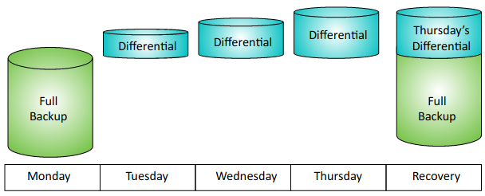
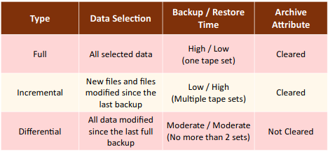

# **5.0 Risk Management**

## 5.1 Explain the importance of policies, plans and procedures related to organizational security.

1. **Standard operating procedure**: A document that provides step-by-step instructions on how to perform common tasks or routine operations.
2. **Agreement types**:
    1. **BPA** (Business partners agreement): A written agreement detailing the relationship between business partners including their obligations.
    2. **SLA** (Service level agreement): An agreement between a company and a vendor that stipulates performance expectations.
    3. **ISA** (Interconnection security agreement): Specifies technical and security requirements for planning, establishing, maintaining and disconnecting a secure connection between two or more entities.
    4. **MOU/MOA** (Memorandum of understanding/agreement): Expresses and understanding between two or more parties indicating their intention to work together toward a common goal.
3. **Personnel management**:
    1. **Mandatory vacations**: A policy that forces employees to take a vacation to deter malicious activity.
    2. **Job rotation**: A process that ensures employees rotate through different jobs to learn the processes and procedures in each job.
    3. **Separation of duties**: A security principle that prevents any single person or entity from controlling all the functions of a critical or sensitive process.
    4. **Clean desk**: A security policy requiring employees to keep their areas organized and free of papers.
    5. **Background checks**: A check into a person's history to determine eligibility for a job.
    6. **Exit interviews**: An interview conducted with departing employees just before they leave an organization.
    7. **NDA** (Non-disclosure agreement): An agreement that is designed to prohibit personnel from sharing proprietary data.
    8. **Onboarding**: The process of granting individuals access to an organization's computing resources after being hired.
    9. **Continuing education**: Personnel need to regularly receive additional training to ensure they are up to date on current threats, vulns and technologies.
    10. **Acceptable use policy/rules of behavior** (AUP): A policy defining proper system usage and the rules of behavior for employees.
    11. **Adverse actions**: Actions that denies employment based on the background check.
4. **Role-based awareness training**: Targeted to personnel based on their role before getting access to minimize the risk of threats.
    1. **Data owner**: Executive level manager, responsible for data security.
    2. **System administrator**: Are responsible for the overall security of a system and enable the applications and data.
    3. **System owner**: Executive level manager, has overall responsibility for the system.
5. **User roles**:
    1. **User**: The application user, has least privileged access to the application and data.
    2. **Privileged user**: Additional application and data permissions.
    3. **Executive user**: Responsible for the overall operation of the application, makes decisions and evaluates goals.
    4. **Incident response team**: Responsible for handling incidents within the department.
6. **General security policies**:
   1. **Social media networks/applications**: People sharing their personal data that can result in inadvertent information disclosure or give attackers information to launch social attacks.
   2. **Personal email**: Some organizations allow employees to use the organization's infrastructure to use their personal email, while others forbid it.

## 5.2 Summarize business impact analysis concepts.

1. **BIA** (Business impact analysis): It helps an organization identify critical systems and components that are essential to the organization's success.
2. **RTO** (Recovery time objective): Identifies the maximum amount of time it should take to restore a system after an outage.
3. **RPO** (Recovery point objective): Refers to the amount of data you can afford to lose.
4. **MTBF** (Mean time between failures): Identifies the average time between failures with the goal of predicting potential outages.
5. **MTTR** (Mean time to recover): Identifies the average time it takes to restore/repair a failed system.
6. **Mission-essential functions** (MEF): A set of functions that must be continued throughout, or resumed rapidly after a disruption of normal operations.
7. **Single point of failure**: A component within a system that can cause the entire system to fail if the component fails.
8. **Impact**: The magnitude of harm related to a risk.
    1. **Life**: The most important consideration.
    2. **Property**: The risk to buildings and assets.
    3. **Safety**: Some environments are too dangerous to work.
    4. **Finance**: The resulting financial cost.
    5. **Reputation**: An event can cause status or character problems.
9. **Privacy impact assessment** (PIA): Attempts to identify potential risks  related to the PII by reviewing how the information is handled.
10. **Privacy threshold assessment** (PTA): Helps the organization identify PII within a system.

## 5.3 Explain risk management processes and concepts.

1. **Threat assessment**: An evaluation of potential threats.
    1. **Environmental**: Tornado, hurricane, earthquake...
    2. **Man-made**: Threats from humans.
    3. **Internal vs external**: Internal threats from employees or external threats from outside the organization.
2. **Risk assessment**
    1. **SLE** (Single loss expectancy): The cost of any single loss.
    2. **ALE** (Annual loss expectancy): Is the value of SLE x ARO.
    3. **ARO** (Annual rate of occurrence): Indicates how many times the loss will occur in a year.
    4. **Asset value**: Identifies the value of an asset and can include any product, system, resource, or process.
    5. **Risk register**: A document listing information about risks.
    6. **Likelihood of occurrence**: The probability that something will occur.
    7. **Supply chain assessment**: An evaluation of the supply chain needed to produce and sell a product.
    8. **Quantitative**: A risk assessment that uses specific monetary amounts to identify cost and asset value.
    9. **Qualitative**: A risk assessment that uses judgment to categorize risks.
    10. **Testing**: It's important to obtain **vulnerability testing authorization** and **penetration testing authorization** before  performing any testing.
    11. **Risk response techniques**: Methods used to manage risks.
        1. **Accept**: When the cost of a control outweighs a risk, an organization will often accept the risk.
        2. **Transfer**: The organization transfers the risk to another entity.
        3. **Avoid**: An organization can avoid a risk by not providing a service or not participating in a risky activity.
        4. **Mitigate**: The organization implements controls to reduce risks.
    12. **Change management**: The process used to prevent unauthorized changes.

## 5.4 Given a scenario, follow incident response procedures.

1. **Incident response plan** (IRP): Provides more detail than the incident response policy.
    1. **Documented incident types/category definitions**: Helps employees identify the difference between an event and an actual incident.
    2. **Roles and responsibilities**: Many incident response plans identify specific roles for an incident response team along with their responsibilities.
    3. **Reporting requirements/escalation**: Depending on the severity of the incident, sec personnel might need to escalate it or notify executives within the company of the incident.
    4. **Cyber-incident response teams**: A cyber-incident response team is composed of employees with expertise in different areas.
    5. **Exercises**: One method  of preparing for incident response is to perform exercises.
2. **Incident response process**
    1. **Preparation**: This phase occurs before an incident and provides guidance to personnel on how to respond to an incident.
    2. **Identification**: All events aren't security incidents so when a potential incident is reported, personnel take the time to verify it is an actual incident.
    3. **Containment**: After identifying an incident, sec personnel attempt to isolate or contain it.
    4. **Eradication**: After containing the incident, it's often necessary to remove components from the attack.
    5. **Recovery**: During the recovery process, admins return all affected systems to normal operation and verify they are operating normally.
    6. **Lessons learned**: After personnel handle an incident, sec personnel perform a lessons learned review.

## 5.5 Summarize basic concepts of forensics.

1. **Order of volatility**: The order in which you should collect evidence.
    1. Order: Cache memory, regular RAM, swap or paging file, hard drive data, logs stored on remote systems and archived media.
2. **Chain of custody**: A process that provides assurances that evidence has been controlled and handled properly after collection.
3. **Legal hold**: Refers to a court order to maintain different types of data as evidence.
4. **Data acquisition and preservation**:
    1. **Capture system image**: A forensic image of a disk captures the entire contents of the drive.
    2. **Network traffic and logs**: Helps re-create events leading up to and during the incident.
    3. **Capture video**: Video surveillance methods are used as a detective control during an investigation.
    4. **Record time offset**: An offset used by recorders to identify times on recordings.
    5. **Take hashes**: To provide proof that collected data has retained integrity.
    6. **Screenshots**: For capturing exactly what a user was doing or specific displays.
    7. **Witness interviews**: Provide firsthand reports of what happened and when it happened.
5. **Recovery**: Extracting data that has been intentionally or accidentally deleted.
6. **Strategic intelligence/counterintelligence gathering**: A plan for increasing the amount of data that they collect.
    1. **Active logging**: This strategy increases the amount of logged data collected on a routine basis.
7. **Track man-hours**: Identify how much time and money is needed for a budget request.

## 5.6 Explain disaster recovery and continuity of operation concepts.

1. **Recovery sites**: An alternate processing site that an organization can user after a disaster.
    1. **Hot site**: Includes everything needed to be operational within 60 minutes.
    2. **Warm site**: A compromise between an expensive hot site and a cold site.
    3. **Cold site**: Will have power and connectivity needed for activation, but little else.
2. **Order of restoration**: After the disaster has passed, the least critical functions go to the primary site first.
3. **Backups**: Copies of data created to ensure that if the original data is lost or corrupted, it can be restored.
    1. Types:
        1. **Differential**: Backs up all the data that has changed or is different since the last full backup.  
           
        2. **Incremental**: Backs up all the data that has changed since the last full or incremental backup.  
           
        3. **Snapshots**: Captures the data at a point in time.
        4. **Full**: Backs up all the selected data.  
    
    2. Geographic considerations:
        1. **Off-site backups**: A copy of a backup should be stored in a separate location.
        2. **Distance**: Depends on the organization, the off-site location will be close or far away.
        3. **Location selection**: Depends on the environmental issues like earthquake zones.
        4. **Legal implications**: Depends on the data stored, the backup will be protected according to gob laws.
        5. **Data sovereignty**: The legal implications when data is stored off-site.
4. **Continuity of operation planning**: It focuses on restoring mission-essential functions at a recovery site after a critical outage.
    1. **Exercises/tabletop**: A discussion-based exercise where participants talk through an event while sitting at a table.
    2. **After-action reports**: The final phase of disaster recovery, includes a review of the disaster.
    3. **Failover**: The process of moving mission-essential functions to the alternate site.
    4. **Alternate processing sites**: An alternate site that the organization can use after a disaster.
    5. **Alternate business practices**: The organization can change the business practices after a disaster.

## 5.7 Compare and contrast various types of controls.

1. **Deterrent**: Attempt to prevent incidents by discouraging threats.
2. **Preventive**: Attempt to prevent security incidents.
3. **Detective**: Attempt to detect when a vulnerability has been exploited.
4. **Corrective**: Attempt to reverse the impact of an incident or problem after it has occurred.
5. **Compensating**: Alternative controls used when it isn't feasible or possible to use the primary control.
6. **Technical**: Uses technology to reduce vulnerabilities.
7. **Administrative**: Primarily administrative and include items such as risk and vulnerability assessments.
8. **Physical**: Uses controls that you can physically touch.

## 5.8 Given a scenario, carry out data security and privacy practices.

1. **Data destruction and media sanitization**: The organization has to ensure that the devices don't include any data.
    1. **Burning**: Burn printed materials in an incinerator.
    2. **Shredding**: Shred papers by passing them through a shredder.
    3. **Pulping**: An additional step taken after shredding paper.
    4. **Pulverizing**: The process of physically destroying media to sanitize it.
    5. **Degaussing**: A very powerful electronic magnet that renders the data on tape and magnetic disks unreadable.
    6. **Purging**: A general sanitization term indicating that all sensitive data has been removed from a device.
    7. **Wiping**: The process of completely removing all remnants of data on a disk.
2. **Data sensitivity labeling and handling**: Ensures that users know what data they are handling and processing.
    1. **Confidential**: Very sensitive, must be approved to view.
    2. **Private**: Internal use only, may require an NDA.
    3. **Public**: No restrictions on viewing the data.
    4. **Proprietary**: Is property of an organization.
    5. **PII**: Personally Identifiable Information is a personal information that can be used to personally identify an individual.
    6. **PHI**: Personal health information is PII that includes health information.
3. **Data roles**: An organization often assigns specific roles to some people with specific responsibilities:
    1. **Owner**: The individual with overall responsibility for the data. CEO or department head.
    2. **Steward/custodian**: Handles the routine tasks to protect data.
    3. **Privacy officer**: An executive position within an organization.
4. **Data retention**: Identifies how long data is retained and sometimes specifies where it is stored.
5. **Legal and compliance**: Organizations have a responsibility to follow all laws that apply to them, and ensure that they remain in compliance.
