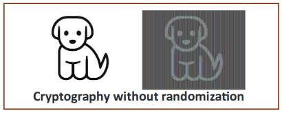
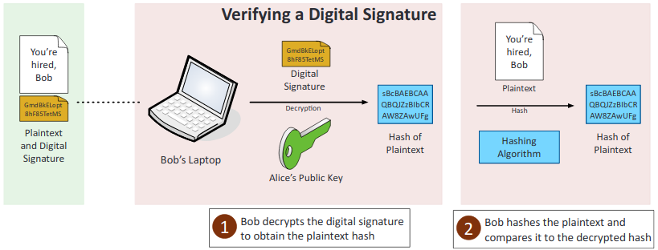
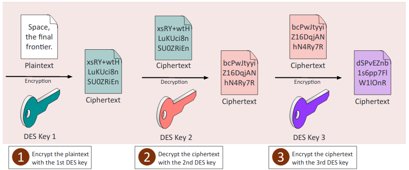
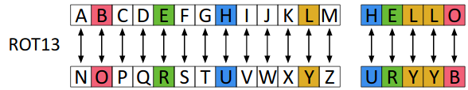

# **6.0 Cryptography and PKI**

## 6.1 Compare and contrast basic concepts of cryptography.

1. **Symmetric algorithms**: A shared secret key used by the sender and receiver to encrypt and decrypt.
2. **Modes of operation**: An algorithm that uses a block cipher to provide security such as confidentiality or authenticity.
3. **Asymmetric algorithms**: There is a shared public key and a private secret key. Public key encrypts and the private key decrypts, private key to sign and public key verify.  
    
    
4. **Hashing**: An algorithm that creates a unique one-way encryption, not plaintext.
5. Salt, IV, nonce:
    1. **Salt**: The adding of input to random data to function to make it more complicated. A small piece of data added to the end of a password when creating a hash.  
       
    2. **IV** (Initialization Vector): A random value used with an encryption key.
    3. **Nonce**: One-time use random value used for authentication.
6. **Elliptic curve** (ECC): Great for low powered machines. Uses curves for encryption instead of large prime numbers.
7. **Weak/deprecated algorithms**: Weak due to vulnerabilities (WEP) or weak key length (DES is on 56-bits) which is easy to brute force through.
8. **Key exchange**: Securely sending keys back and forth. Out-of-Band where the key is sent over the phone, in person, or any other way offline. In-Band is sent over the internet encrypted.
9. **Digital signatures**: Provides integrity, verifies that the original sender is actually the one who sent it. This can be done through asymmetric encryption, where there is a hash message then they will encrypt the hash using their private key, creating a digital signature that can only originate from them. To verify, the signature is decrypted with the public key, and the message is then hashed. If the two hashes match, then the digital signature is valid.  
    
    
10. **Diffusion**: Changing one character causes the plaintext to drastically change the outputted cipher.
11. **Confusion**: The cipher doesn’t look anything like the plain text.
12. **Collision**: Two completely different pieces of data have the exact same hash.
13. **Steganography**: Hides messages or code inside of an image or another type of data. Impossible to decipher without the correct tools.
14. **Obfuscation**: Taking something and making it difficult for a human to understand, however it is not impossible to convert it back to the original form.
15. **Stream vs. block**: Stream ciphers encrypt data 1 bit at a time (High speed). Block ciphers encrypt data in blocks.
16. **Key strength**: Larger keys and more bits are signs of better encryption and stronger keys.
17. **Session keys**: Symmetric keys used to provide a secure and fast online connection. The server’s public key is paired with a random key to produce a symmetric key, that the server uses to encrypt and the user to decrypt.
18. **Ephemeral key**: Session keys that only last temporarily and change frequently.
19. **Secret algorithm**: Is a symmetric encryption. Uses the same key for the sender to encrypt and the receiver to decrypt.
20. **Data-in-transit**: Data being transmitted over a network. Should be encrypted using TLS and IPSec.
21. **Data-at-rest**: Data in a storage device.
22. **Data-in-use**: Data being ran through RAM or CPU, is almost always decrypted to make it easier to use.
23. **Random/pseudo-random**:
     1. **Number generation**: Used to create random keys and salts, a computer is never truly random, so it relies on outside factors such as user input to create a more random number.
24. **Key stretching**: Hashing a password, and then hashing that hashed value. Protects a weak password from brute force attacks.
25. Implementation vs. algorithm selection:
     1. **Crypto service provider**: A library of cryptographic standards and algorithms.
     2. **Crypto modules**: Hardware, firmware or software that provides the hash, HMAC, cipher, decipher, sign, and verify methods.
26. **Perfect forward secrecy** (PFS): Prevents point of failure where a stolen private key can decrypt all connections by generating a new key each session. Protects past sessions against future compromises of secret keys.
27. **Security through obscurity**: Relying on secrecy to protect and secure data.
28. Common use cases:
     1. **Low power devices**: Mobile phones and portable devices.
     2. **Low latency**: Low amount of time occurs between input and output.
     3. **High resiliency**: Larger key sizes and encryption algorithm quality.
     4. **Supporting confidentiality**: Secrecy and privacy.
     5. **Supporting integrity**: Preventing modification of data and validating contents with hashes.
     6. **Supporting obfuscation**:
     7. **Supporting authentication**: Password hashing and protecting the original password.
     8. **Supporting non-repudiation**: Digital signature provides: authenticity, integrity, and non-repudiation.
     9. **Resource vs. security constraints**: Limitations in providing strong cryptography due to the amount of available resources (time and energy) vs the security provided by cryptography.

## 6.2 Explain cryptography algorithms and their basic characteristics.

1. **Symmetric algorithms**:
    1. **AES** (Advanced Encryption Standard): Symmetric, block cipher with 128-bit blocks, key sizes of 128-bit, 192-bit and 256-bit. It utilizes the Rijndael algorithm and is the U.S. government standard for the secure exchange of sensitive but unclassified data. It is also the encryption standard used today with WPA2.
    2. **DES** (Data Encryption Standard): Symmetric, was common until replaced by AES, the block cipher is 64-bit and the key is 56-bit (very small), this means it can easily be brute forced.
    3. **3DES**: Symmetric, very secure and upgrade over DES with three separate keys and three passes over data. Not used in modern day either.  
        
    4. **RC4**: Symmetric, part of the original WEP standard with SSL, removed from TLS, key sizes of 40-bit to 2048-bit. Deprecated from biased output.
    5. Blowfish/Twofish:
        1. **Blowfish**: Symmetric, fast and has variable key-lengths from 1-bit to 448-bits, uses 64-bit block cipher. Not limited by patents.
        2. **Twofish**: Symmetric, uses a very complex key structure up to 256-bits but still similar to predecessor, works using 128-bit blocks. Again, not limited by patents.
2. Cipher modes:
    1. **CBC** (Cipher Block Chaining): Symmetric, uses IV for randomization. Encryption that is dependent on the block before it. Slow.  
       
    2. **GCM** (Galois Counter Mode): Used by many. Provides data authenticity/integrity, hashes as well. Widely used.
    3. **ECB** (Electronic Code Book): Mode of operation, simplest cipher mode, not recommended.  
       
    4. **CTR** (Counter Mode): Converts block into stream, uses IV. Widely used.  
       
    5. Stream vs. block: Stream ciphers encrypt data 1 bit at a time (High speed). Block ciphers encrypt data in blocks.
3. **Asymmetric algorithms**:
    1. **RSA** (Rivest, Shamir, Adleman): First practical use of public key cryptography, uses large prime numbers as the basis for encryption.
    2. **DSA** (Digital Signature Algorithm): Standard for digital signatures and modifies Diffie-Hellman, follows usage of elliptic curves to create ECDSA.
    3. **Diffie-Hellman**: An asymmetric standard for exchanging keys. Primarily used to send private keys over public (unsecured) networks.
        1. **Groups**: Diffie-Hellman (DH) groups determine the strength of the key used in the key exchange process. Higher group numbers are more secure, but require additional time to compute the key.
        2. **DHE** (Diffie-Hellman Ephemeral): A Diffie-Hellman key exchange that uses different keys.
        3. **ECDHE** (Elliptic Curve Diffie-Hellman Ephemeral): Key agreement protocol that allows 2 parties, each having an elliptic curve public-private key pair, to establish a shared secret over an insecure channel.
    4. **Elliptic curve cryptography** (ECC): Asymmetric, uses smaller key sizes and curve algorithms to secure data, useful in portable devices because it uses less CPU power.
    5. PGP/GPG:
        1. **PGP** (Pretty Good Privacy): Asymmetric, used by many for emails and is used by IDEA algorithm.
        2. **GPG** (GNU Privacy Guard): A free, open-source version of PGP that provides equivalent encryption and authentication services.
4. **Hashing algorithms**: Hashing provides integrity and authenticity.
    1. **MD5** (Message-Digest Algorithm v5): Hashing algorithm, 128-bit hash with strong security, collision was found in 1996 so it is not used as much nowadays.
    2. **SHA** (Secure Hash Algorithm): Hashing algorithm, one-way 160-bit hash value with encryption protocol. Standard hash algorithm today, went from SHA-1 (160-bit digest, deprecated) to SHA-2 (512-bit digest, still used).
    3. **HMAC** (Hash-Based Message Authentication Code): Hashing algorithm that combines itself with a symmetric key. Provides data integrity as well as authenticity, but is faster than asymmetric encryption.
    4. **RIPEMD** (RACE Integrity Primitives Evaluation Message Digest): Hashing algorithm that is based on MD4, collisions were found so it now exists in versions of 160-bits, 256-bits, and 320-bits.
5. **Key stretching algorithms**: Lengthen key to make brute-force attacks harder.
    1. **Bcrypt**: Key Stretching that helps protect passwords by repeating Blowfish cipher.
    2. **PBKDF2** (Password-Based Key Derivation Function 2): Key Stretching, applies RSA function to password to create stronger key.
6. **Obfuscation**: Making something unclear to read, but can still reverse it.
    1. **XOR** (Exclusive OR): Mathematical operation that's a part of all symmetric operations, done by comparing bits of plaintext and a key (same=0, different=1). Can be reversed to get plaintext back.  
       
    2. **ROT13** (Rotate by 13): Common substitution cipher, rotates each letter 13 places.  
       
    3. **Substitution ciphers**: Cipher that changes one symbol for another, like the Caesar Cipher. Easy to decrypt.

## 6.3 Given a scenario, install and configure wireless security settings.

1. Cryptographic protocols:
    1. **WPA** (Wi-Fi Protected Access): Uses RC4 with TKIP. Was replaced by WPA2.
    2. **WPA2** (Wi-Fi Protected Access v2): Uses CCMP for encryption.
    3. **CCMP** (Counter Mode with Cipher Block Chaining Message Authentication Code Protocol): Is based on 128-bit AES is more secure than TKIP. Was advanced for its time.
    4. **TKIP** (Temporal Key Integrity Protocol): Protocol that mixes a root key with an initialization vector, a new key for each packet.
2. Authentication protocols:
    1. **EAP** (Extensible Authentication Protocol): Is an authentication framework that provides general guidance for authentication methods.
    2. **PEAP** (Protected Extensible Authentication Protocol): An extension of EAP that is sometimes used with 802.1x, a certificate is required on the 802.1x server.
    3. **EAP-FAST** (EAP Flexible Authentication with Secure Tunneling): A Cisco-designed replacement for Lightweight EAP, supports certificates but are not required.
    4. **EAP-TLS** (EAP Transport Layer Security): This is one of the most secure EAP standards and is widely implemented on many networks. It uses PKI, so certificates are required on the 802.1x server and on the clients.
    5. **EAP-TTLS** (EAP Tunneled Transport Layer Security): Allows for systems to use older authentication methods such as PAP within a TLS tunnel. Certificate is required on the 802.1x server but not on the clients.
    6. **IEEE 802.1x**: An authentication protocol used in VPNs, wired and wireless networks. In VPNs it is used as a RADIUS server, wired use it as a port-based authentication, and wireless use it in Enterprise mode. Can be used with certificate-based authentication.
    7. **RADIUS** Federation: Members of one organization can authenticate to the network of another network using their normal credentials.
3. Methods:
    1. PSK vs. Enterprise vs. Open:
        1. **PSK** (Pre-Shared Key): Uses WPA2 encryption along with a key that everyone needs to know to access the network.
        2. **Enterprise**: Users to authenticate using a username and password, and uses 802.1X to provide authentication, server handles distribution of keys/certificates.
        3. **Open**: Does not apply any security.
    2. **WPS**: Allows users to easily configure a wireless network, often by using only a PIN. Are susceptible to brute force attacks because they can discover the PIN.
    3. **Captive portals**: Forces clients using a web browser to complete a task before being able to access the network.

## 6.4 Given a scenario, implement public key infrastructure.

1. Components:
    1. **CA** (Certificate Authority): A trusted third-party agency that is responsible for issuing digital certificates.
    2. **Intermediate CA** (Intermediate Certificate Authority): An entity that processes the CSR and verifies the authenticity of the user on behalf of a CA.
    3. **CRL** (Certificate Revocation List): A list of certificates that are no longer valid, expired, or that have been revoked by the issuer.
    4. **OCSP** (Online Certificate Status Protocol): A request and response protocol that obtains the serial number of the certificate that is being validated and reviews revocation lists for the client.
    5. **CSR** (Certificate Signing Request): A user request for a digital certificate
    6. **Certificate**: Digitally signed statement that associates a public key to the corresponding private key.
    7. **Public key**: A key that is provided by the sender, used by anyone to encrypt with asymmetric.
    8. **Private key**: Key used to decrypt a message, only used by the person opening the message.
    9. **Object identifiers** (OID): A serial number that authenticates a certificate.
2. Concepts:
    1. Online vs. offline CA:
        1. **Online CA**: Is directly connected to a network, most common.
        2. **Offline CA**: Is not directly connected to a network, often used for root certificates.
    2. **Stapling**: Combining related items in order to reduce communication steps. The device that holds the certificate will also be the one to provide status of any revocation.
    3. **Pinning**: The application has hard-coded the server’s certificate into the application itself.
    4. **Trust model**: A complex structure of: systems, personnel, applications, protocols, technologies, and policies working together to provide protection.
    5. **Key escrow**: Private keys are kept by the users and a 3rd party as back-ups.
    6. **Certificate chaining**: Certificates are handled by a chain of trust, the trust anchor for the digital cert is the root CA.
3. Types of certificates:
    1. **Wildcard**: A Certificate that can be used with multiple subdomains of a given domain, by covering the all subordinate certificates to the root.
    2. **SAN** (Subject Alternative Name): The certificate has several uses, allows a certificate to be valid for multiple domains using multiple names.
    3. **Code signing**: Digitally signs written application code and makes sure that it adheres to policy restriction and usage.
    4. **Self-signed**: The root CA creates its own certificate.
    5. **Machine/computer**: Certificates that are assigned to a specific machine.
    6. **Email**: Secures emails, is used by S/MIME.
    7. **User**: Often for authentication or to access resources.
    8. **Root**: Used for root authorities, they usually are self-signed.
    9. **Domain validation**: Provides a secure communication with a specific domain and provides TLS, this is the most common form of certificate.
    10. **Extended validation**: Are more secure because they require more validation from the certification holder.
4. Certificate formats:
    1. **DER** (Distinguished Encoding Rules): Are common and designed for X.509 certificates, they are used to extend binary encoded certificates. Cannot be edited by a plain text editor. Used with Java commonly.
    2. **PEM** (Privacy Enhanced Mail): Most common format in which certificates are issued. Multiple certificates and the private key can be included in one file. The file is encoded ASCII. PEM file extensions include .pem, .crt, .cer, and .key. Apache servers typically use PEM-format files.
    3. **PFX**: A precursor to P12, has the same usage. Administrators often use this to format on Windows to import and export certificates.
    4. **CER** (Certificate File): May be encoded as binary DER or as ASCII PEM.
    5. **P12**: Is a PFX extension used in windows
        1. **PKS 12** (Public Key Cryptography Standards #12): Is part of the RFC standard. Stores many types of certificates and can be password protected.
        2. **RFC** (Remote Function Call): A formal document describes the specifications for a particular technology, was drafted by the Internet Engineering Task Force.
    6. **P7B**: Is stored in Base64 ASCII, containing certificates and chains but not the private key.
